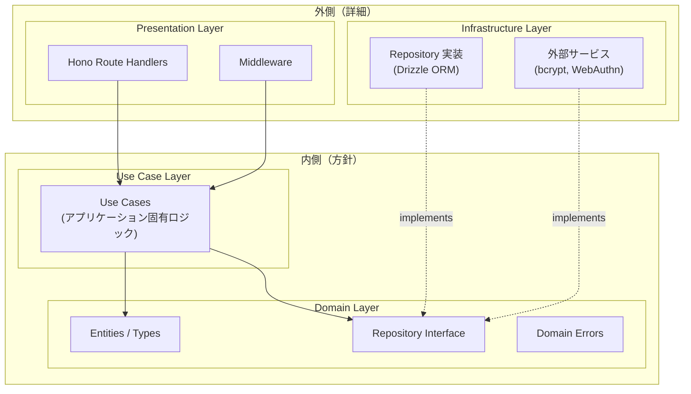
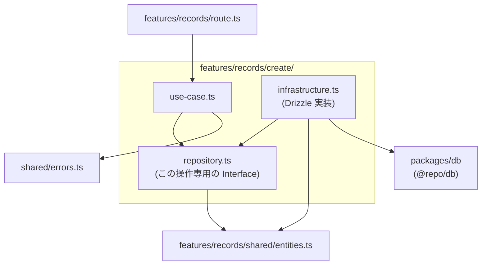
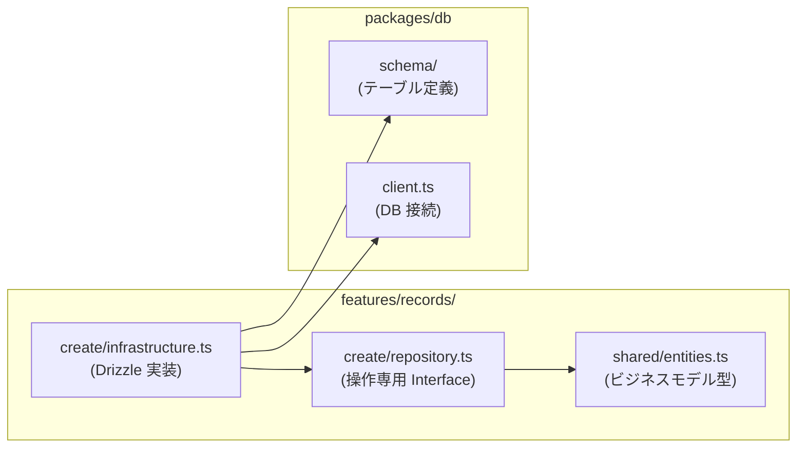
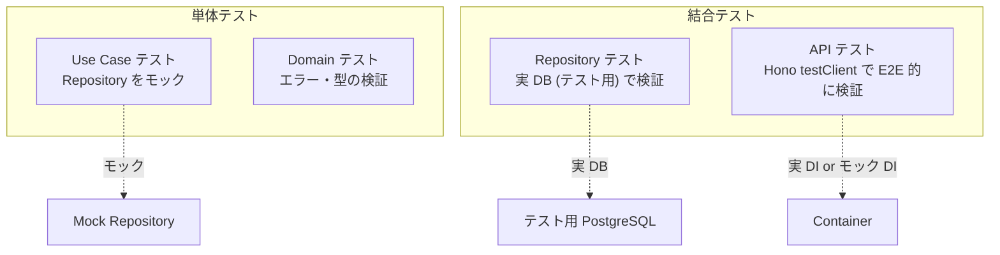

## 方針

API レイヤーはクリーンアーキテクチャの原則に従い、**依存関係を内側に向ける**構成をとる。
これにより各レイヤーを独立してテスト可能にし、フレームワークや DB 実装への結合を最小化する。

## レイヤー構成



### 依存関係のルール

| ルール | 説明 |
| --- | --- |
| **依存は内側に向ける** | 外側のレイヤーは内側に依存してよいが、内側は外側を知らない |
| **Domain は何にも依存しない** | Entity・Repository Interface は純粋な TypeScript 型・関数のみ |
| **Use Case は Domain にのみ依存** | Repository Interface を通じてデータにアクセスし、具体的な DB 実装を知らない |
| **Infrastructure は Interface を実装** | Drizzle ORM や bcrypt などの具体実装は Infrastructure で閉じる |
| **Presentation は Use Case を呼ぶ** | Hono の Route Handler は Use Case を呼び出し、HTTP の関心事だけを担う |

## 各レイヤーの責務

### Domain Layer

最も内側のレイヤー。ビジネスルールとデータ構造を定義する。外部ライブラリへの依存は持たない。

| 要素 | 責務 | 例 |
| --- | --- | --- |
| Entities / Types | ビジネスデータの型定義 | `User`, `Record`, `Session` |
| Repository Interface | データアクセスの契約（抽象） | `RecordRepository`, `UserRepository` |
| Errors | ドメイン固有のエラー型 | `NotFoundError`, `AuthenticationError` |

### Use Case Layer

アプリケーション固有のビジネスロジックを実装する。1 ユースケース = 1 関数の原則で構成する。

| 要素 | 責務 | 例 |
| --- | --- | --- |
| Use Case 関数 | ビジネスロジックのオーケストレーション | `createRecord`, `login`, `register` |

Use Case は Repository Interface を引数（依存注入）で受け取り、具体実装には依存しない。

### Infrastructure Layer

外部システム（DB・ライブラリ）との接続を担う。Domain で定義した Interface の具体実装を提供する。

| 要素 | 責務 | 例 |
| --- | --- | --- |
| Repository 実装 | Drizzle ORM を使った DB アクセス | `DrizzleRecordRepository` |
| サービス実装 | 外部ライブラリを使った処理 | bcrypt によるハッシュ化 |

### Presentation Layer

HTTP リクエスト／レスポンスの変換を担う。Hono のルートハンドラとミドルウェアで構成する。

| 要素 | 責務 | 例 |
| --- | --- | --- |
| Route Handlers | HTTP → Use Case → HTTP の変換 | `POST /api/records` のハンドラ |
| Middleware | 横断的関心事の処理 | 認証チェック、エラーハンドリング |

## ファイル構成

**エンドポイント（機能）ごとに垂直スライス**し、さらに **CRUD 操作ごとにディレクトリを分離**する。各操作が専用の `repository.ts`（Interface）を持つことで、インターフェース分離の原則（ISP）に従う。

```
apps/web/src/server/
├── features/
│   ├── auth/
│   │   ├── shared/
│   │   │   └── entities.ts              … User, Session, Credential 型
│   │   ├── register/
│   │   │   ├── repository.ts            … { findByUserId, createUser, createSession }
│   │   │   ├── use-case.ts
│   │   │   └── infrastructure.ts
│   │   ├── login/
│   │   │   ├── repository.ts            … { findByUserId, createSession }
│   │   │   ├── use-case.ts
│   │   │   └── infrastructure.ts
│   │   ├── logout/
│   │   │   ├── repository.ts            … { deleteSession }
│   │   │   ├── use-case.ts
│   │   │   └── infrastructure.ts
│   │   ├── me/
│   │   │   ├── repository.ts            … { findUserById }
│   │   │   ├── use-case.ts
│   │   │   └── infrastructure.ts
│   │   └── route.ts                     … Hono ルートハンドラ（/api/auth/*）
│   ├── records/
│   │   ├── shared/
│   │   │   └── entities.ts              … Record 型
│   │   ├── create/
│   │   │   ├── repository.ts            … { create, findByUserIdAndDate }
│   │   │   ├── use-case.ts
│   │   │   └── infrastructure.ts
│   │   ├── list/
│   │   │   ├── repository.ts            … { findMany }
│   │   │   ├── use-case.ts
│   │   │   └── infrastructure.ts
│   │   ├── get/
│   │   │   ├── repository.ts            … { findById }
│   │   │   ├── use-case.ts
│   │   │   └── infrastructure.ts
│   │   ├── update/
│   │   │   ├── repository.ts            … { findById, update }
│   │   │   ├── use-case.ts
│   │   │   └── infrastructure.ts
│   │   ├── delete/
│   │   │   ├── repository.ts            … { findById, delete }
│   │   │   ├── use-case.ts
│   │   │   └── infrastructure.ts
│   │   └── route.ts                     … Hono ルートハンドラ（/api/records/*）
│   └── health/
│       └── route.ts                     … ヘルスチェック（/api/health）
├── shared/
│   ├── errors.ts                        … 共通ドメインエラー
│   └── middleware/
│       ├── auth.ts                      … 認証ミドルウェア
│       └── error-handler.ts             … DomainError → HTTP レスポンス変換
├── app.ts                               … Hono アプリ定義・全 feature のルートマウント
└── container.ts                         … DI コンテナ（依存のワイヤリング）
```

### 構成のポイント

| 方針 | 説明 |
| --- | --- |
| **操作ごとの垂直スライス** | 1 つの CRUD 操作に必要な repository / use-case / infrastructure が 1 ディレクトリに収まる |
| **Repository Interface の分離（ISP）** | 各操作は自分が必要なメソッドだけを定義した `repository.ts` を持つ。モックが最小限で済む |
| **feature 内の共有型** | Entity 型など操作をまたいで共通のものは `shared/` に配置 |
| **feature 間の独立性** | `records/` の変更が `auth/` に影響しない。feature 間の直接参照は禁止 |
| **route.ts は feature 単位** | 各操作の use-case を束ねて Hono ルートを定義する |

### 操作ディレクトリ内の依存関係



### `packages/db` との関係

DB スキーマは `packages/db` で定義する（Drizzle ORM のテーブル定義・マイグレーション）。
各 feature の `shared/entities.ts` はアプリケーションが扱う**ビジネスモデルの型**を定義し、DB スキーマとは独立させる。



各操作の `infrastructure.ts` のみが `packages/db` に依存する。`repository.ts`・`use-case.ts` は DB の存在を知らない。

## コード例

`records/create` を例に、各ファイルの実装を示す。

### Entity（feature 内共有）

```ts
// server/features/records/shared/entities.ts
export type Record = {
  id: string;
  userId: string;
  date: string;
  timeOfDay: "morning" | "night";
  physical: number;
  mental: number;
  comment: string | null;
  createdAt: Date;
  updatedAt: Date;
};
```

### Repository Interface（操作専用）

各操作は**自分が必要なメソッドだけ**を定義した `repository.ts` を持つ。

```ts
// server/features/records/create/repository.ts
import type { Record } from "../shared/entities";

export type CreateRecordInput = {
  userId: string;
  date: string;
  timeOfDay: "morning" | "night";
  physical: number;
  mental: number;
  comment: string | null;
};

export interface CreateRecordRepository {
  findByUserIdAndDate(
    userId: string,
    date: string,
    timeOfDay: "morning" | "night",
  ): Promise<Record | null>;
  create(input: CreateRecordInput): Promise<Record>;
}
```

他の操作も同様に、必要最小限のメソッドだけを定義する:

```ts
// server/features/records/list/repository.ts
import type { Record } from "../shared/entities";

export type ListRecordsInput = {
  userId: string;
  limit: number;
  offset: number;
};

export interface ListRecordsRepository {
  findMany(input: ListRecordsInput): Promise<{ records: Record[]; total: number }>;
}
```

```ts
// server/features/records/get/repository.ts
import type { Record } from "../shared/entities";

export interface GetRecordRepository {
  findById(id: string): Promise<Record | null>;
}
```

```ts
// server/features/records/update/repository.ts
import type { Record } from "../shared/entities";

export type UpdateRecordInput = {
  physical?: number;
  mental?: number;
  comment?: string | null;
};

export interface UpdateRecordRepository {
  findById(id: string): Promise<Record | null>;
  update(id: string, input: UpdateRecordInput): Promise<Record>;
}
```

```ts
// server/features/records/delete/repository.ts
import type { Record } from "../shared/entities";

export interface DeleteRecordRepository {
  findById(id: string): Promise<Record | null>;
  delete(id: string): Promise<void>;
}
```

### Shared: Domain Errors

feature をまたいで共通のエラー型は `shared/` に配置する。

```ts
// server/shared/errors.ts
export class DomainError extends Error {
  constructor(
    public readonly code: string,
    message: string,
  ) {
    super(message);
    this.name = "DomainError";
  }
}

export class NotFoundError extends DomainError {
  constructor(resource: string) {
    super("NOT_FOUND", `${resource}が見つかりません`);
  }
}

export class AuthenticationError extends DomainError {
  constructor() {
    super("UNAUTHORIZED", "認証に失敗しました");
  }
}

export class ForbiddenError extends DomainError {
  constructor() {
    super("FORBIDDEN", "アクセス権限がありません");
  }
}

export class ConflictError extends DomainError {
  constructor(message: string) {
    super("CONFLICT", message);
  }
}
```

### Use Case

```ts
// server/features/records/create/use-case.ts
import type { CreateRecordRepository, CreateRecordInput } from "./repository";
import { ConflictError } from "../../../shared/errors";

export type CreateRecordDeps = {
  repository: CreateRecordRepository;
};

export async function createRecord(deps: CreateRecordDeps, input: CreateRecordInput) {
  const existing = await deps.repository.findByUserIdAndDate(
    input.userId,
    input.date,
    input.timeOfDay,
  );

  if (existing) {
    throw new ConflictError("同じ日時の記録が既に存在します");
  }

  return deps.repository.create(input);
}
```

Use Case 関数は `deps` 引数で依存を受け取る。
`CreateRecordRepository` は `findByUserIdAndDate` と `create` の 2 メソッドしか持たないため、テスト時のモックが最小限で済む。

### Infrastructure: Repository 実装

```ts
// server/features/records/create/infrastructure.ts
import { eq, and } from "drizzle-orm";
import { db } from "@repo/db";
import { records } from "@repo/db/schema";
import type { CreateRecordRepository } from "./repository";
import type { Record } from "../shared/entities";

export function createDrizzleCreateRecordRepository(): CreateRecordRepository {
  return {
    async findByUserIdAndDate(userId, date, timeOfDay) {
      const row = await db.query.records.findFirst({
        where: and(
          eq(records.userId, userId),
          eq(records.date, date),
          eq(records.timeOfDay, timeOfDay),
        ),
      });
      return row ? toEntity(row) : null;
    },

    async create(input) {
      const [row] = await db.insert(records).values(input).returning();
      return toEntity(row);
    },
  };
}

function toEntity(row: typeof records.$inferSelect): Record {
  return {
    id: row.id,
    userId: row.userId,
    date: row.date,
    timeOfDay: row.timeOfDay,
    physical: row.physical,
    mental: row.mental,
    comment: row.comment,
    createdAt: row.createdAt,
    updatedAt: row.updatedAt,
  };
}
```

### Presentation: Route Handler

feature ごとに 1 つの `route.ts` で、各操作の use-case を束ねて Hono ルートを定義する。

```ts
// server/features/records/route.ts
import { Hono } from "hono";
import { zValidator } from "@hono/zod-validator";
import { z } from "zod";
import { createRecord } from "./create/use-case";
import { listRecords } from "./list/use-case";
import { getRecord } from "./get/use-case";
import { updateRecord } from "./update/use-case";
import { deleteRecord } from "./delete/use-case";
import type { AppEnv } from "../../app";

const createRecordSchema = z.object({
  date: z.string().date(),
  timeOfDay: z.enum(["morning", "night"]),
  physical: z.number().min(0).max(5),
  mental: z.number().min(0).max(5),
  comment: z.string().max(200).nullable(),
});

export const recordRoutes = new Hono<AppEnv>()
  .post("/", zValidator("json", createRecordSchema), async (c) => {
    const body = c.req.valid("json");
    const userId = c.get("userId");
    const record = await createRecord(
      { repository: c.get("deps").records.create },
      { ...body, userId },
    );
    return c.json({ data: record }, 201);
  })
  .get("/", async (c) => {
    const userId = c.get("userId");
    const limit = Number(c.req.query("limit") ?? 20);
    const offset = Number(c.req.query("offset") ?? 0);
    const result = await listRecords(
      { repository: c.get("deps").records.list },
      { userId, limit, offset },
    );
    return c.json({ data: result.records, meta: { total: result.total, limit, offset } });
  })
  .get("/:id", async (c) => {
    const record = await getRecord(
      { repository: c.get("deps").records.get },
      { id: c.req.param("id"), userId: c.get("userId") },
    );
    return c.json({ data: record });
  });
  // ... PATCH /:id, DELETE /:id も同様
```

### アプリ定義（ルートマウント）

```ts
// server/app.ts
import { Hono } from "hono";
import { authRoutes } from "./features/auth/route";
import { recordRoutes } from "./features/records/route";
import { healthRoutes } from "./features/health/route";
import { authMiddleware } from "./shared/middleware/auth";
import { errorHandler } from "./shared/middleware/error-handler";
import type { Container } from "./container";

export type AppEnv = {
  Variables: {
    userId: string;
    deps: Container;
  };
};

export function createApp(container: Container) {
  return new Hono<AppEnv>()
    .use("*", async (c, next) => {
      c.set("deps", container);
      await next();
    })
    .onError(errorHandler)
    .route("/health", healthRoutes)
    .route("/auth", authRoutes)
    .use("/records/*", authMiddleware)
    .route("/records", recordRoutes);
}
```

### 依存注入（DI）

```ts
// server/container.ts
import { createDrizzleCreateRecordRepository } from "./features/records/create/infrastructure";
import { createDrizzleListRecordsRepository } from "./features/records/list/infrastructure";
import { createDrizzleGetRecordRepository } from "./features/records/get/infrastructure";
import { createDrizzleUpdateRecordRepository } from "./features/records/update/infrastructure";
import { createDrizzleDeleteRecordRepository } from "./features/records/delete/infrastructure";
import { createDrizzleRegisterRepository } from "./features/auth/register/infrastructure";
import { createDrizzleLoginRepository } from "./features/auth/login/infrastructure";
import { createDrizzleLogoutRepository } from "./features/auth/logout/infrastructure";
import { createDrizzleMeRepository } from "./features/auth/me/infrastructure";

export function createContainer() {
  return {
    auth: {
      register: createDrizzleRegisterRepository(),
      login: createDrizzleLoginRepository(),
      logout: createDrizzleLogoutRepository(),
      me: createDrizzleMeRepository(),
    },
    records: {
      create: createDrizzleCreateRecordRepository(),
      list: createDrizzleListRecordsRepository(),
      get: createDrizzleGetRecordRepository(),
      update: createDrizzleUpdateRecordRepository(),
      delete: createDrizzleDeleteRecordRepository(),
    },
  };
}

export type Container = ReturnType<typeof createContainer>;
```

DI コンテナは操作ごとの Repository 実装をワイヤリングし、`app.ts` の middleware 経由で各ハンドラに渡す。
DI ライブラリは使用せず、関数ベースのシンプルな構成とする。

## テスト戦略

クリーンアーキテクチャの最大の利点は、各レイヤーを**独立してテスト**できることにある。



### 単体テスト（Use Case）

操作専用の Repository Interface をモックして、ビジネスロジックだけを検証する。
`CreateRecordRepository` は 2 メソッドしかないため、モックの記述量が最小限になる。

```ts
// server/features/records/create/use-case.test.ts
import { describe, it, expect } from "vitest";
import { createRecord } from "./use-case";
import { ConflictError } from "../../../shared/errors";
import type { CreateRecordRepository } from "./repository";

function createMockRepository(
  overrides: Partial<CreateRecordRepository> = {},
): CreateRecordRepository {
  return {
    findByUserIdAndDate: async () => null,
    create: async (input) => ({
      id: "test-id",
      ...input,
      createdAt: new Date(),
      updatedAt: new Date(),
    }),
    ...overrides,
  };
}

describe("createRecord", () => {
  it("記録を作成できる", async () => {
    const mockRepo = createMockRepository();
    const result = await createRecord(
      { repository: mockRepo },
      {
        userId: "user-1",
        date: "2025-04-03",
        timeOfDay: "morning",
        physical: 3,
        mental: 4,
        comment: "調子良い",
      },
    );

    expect(result.physical).toBe(3);
    expect(result.mental).toBe(4);
  });

  it("同じ日時の記録が存在する場合は ConflictError", async () => {
    const mockRepo = createMockRepository({
      findByUserIdAndDate: async () => ({
        id: "existing",
        userId: "user-1",
        date: "2025-04-03",
        timeOfDay: "morning",
        physical: 3,
        mental: 4,
        comment: null,
        createdAt: new Date(),
        updatedAt: new Date(),
      }),
    });

    await expect(
      createRecord(
        { repository: mockRepo },
        {
          userId: "user-1",
          date: "2025-04-03",
          timeOfDay: "morning",
          physical: 3,
          mental: 4,
          comment: null,
        },
      ),
    ).rejects.toThrow(ConflictError);
  });
});
```

### テストの層別まとめ

| テスト種別 | 対象 | モック対象 | 検証内容 |
| --- | --- | --- | --- |
| Domain 単体 | Errors, Entity ロジック | なし | エラー型の正しさ、バリデーションロジック |
| Use Case 単体 | Use Case 関数 | Repository | ビジネスロジックの分岐・エラーハンドリング |
| Repository 結合 | Infrastructure 実装 | なし（実 DB） | SQL の正しさ、マッピング |
| API 結合 | Route Handler | 任意（Container ごと差し替え可） | HTTP ステータス、レスポンス形式 |

## 設計判断

### なぜ操作ごとに Repository Interface を分けるのか

- **インターフェース分離の原則（ISP）**: 各 use-case は自分が使うメソッドだけに依存する。不要なメソッドへの依存がなくなる
- **モックの最小化**: `CreateRecordRepository` は 2 メソッドだけなので、テスト時のモック記述量が最小限で済む
- **変更影響の局所化**: `list` のクエリ条件を変更しても `create` の repository.ts・テストには影響しない
- **可読性**: ディレクトリを開くだけで、その操作が DB に対して何をするか（= repository.ts のメソッド一覧）が即座に分かる

### なぜ DI ライブラリを使わないのか

- プロジェクト規模が小さく、関数ベースの DI で十分
- 型推論が自然に効き、追加の学習コストがない
- 必要になった段階で `tsyringe` 等に移行可能

### なぜ Use Case を関数にするのか

- クラスベースと比べてボイラープレートが少ない
- `deps` 引数による明示的な依存注入で、テスト時のモック差し込みが容易
- TypeScript の型推論と相性が良い

### Entity を DB スキーマと分離する理由

- DB スキーマの変更がビジネスロジックに波及しない
- Drizzle ORM の型に Use Case が直接依存することを防ぐ
- Infrastructure の `toEntity` 関数でマッピングを一元管理
