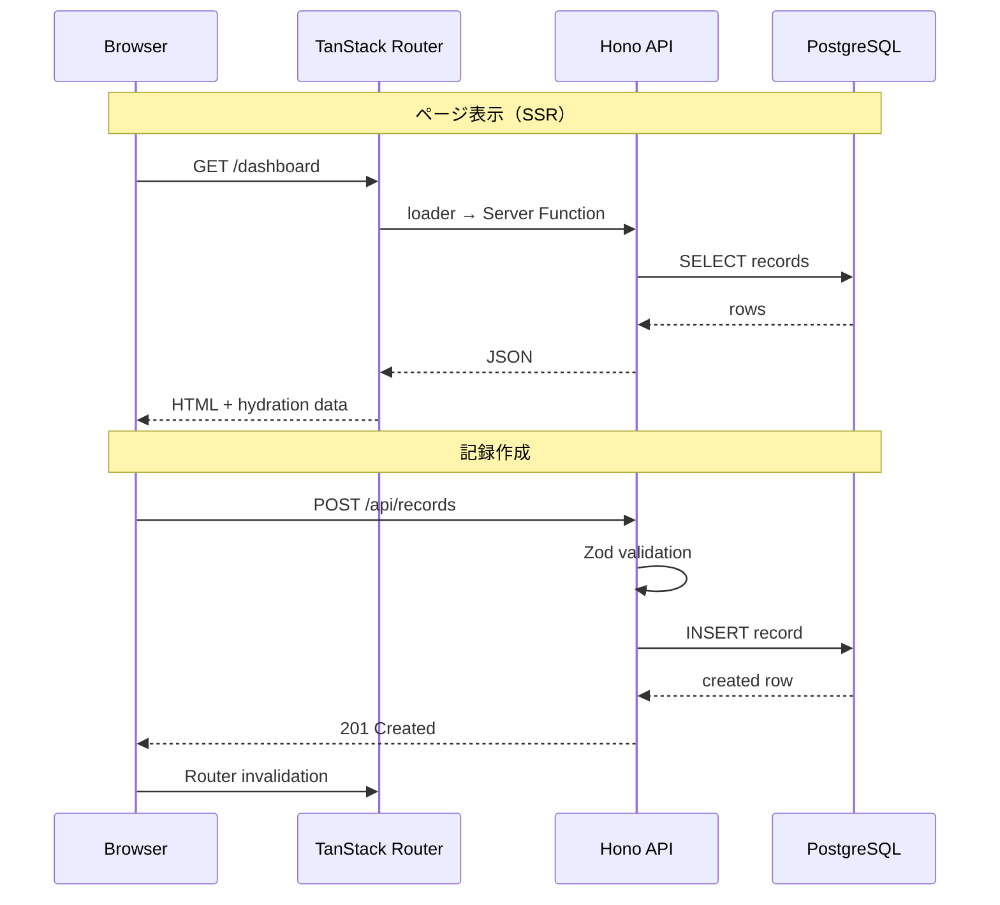
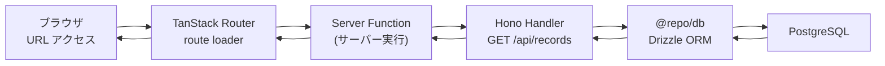
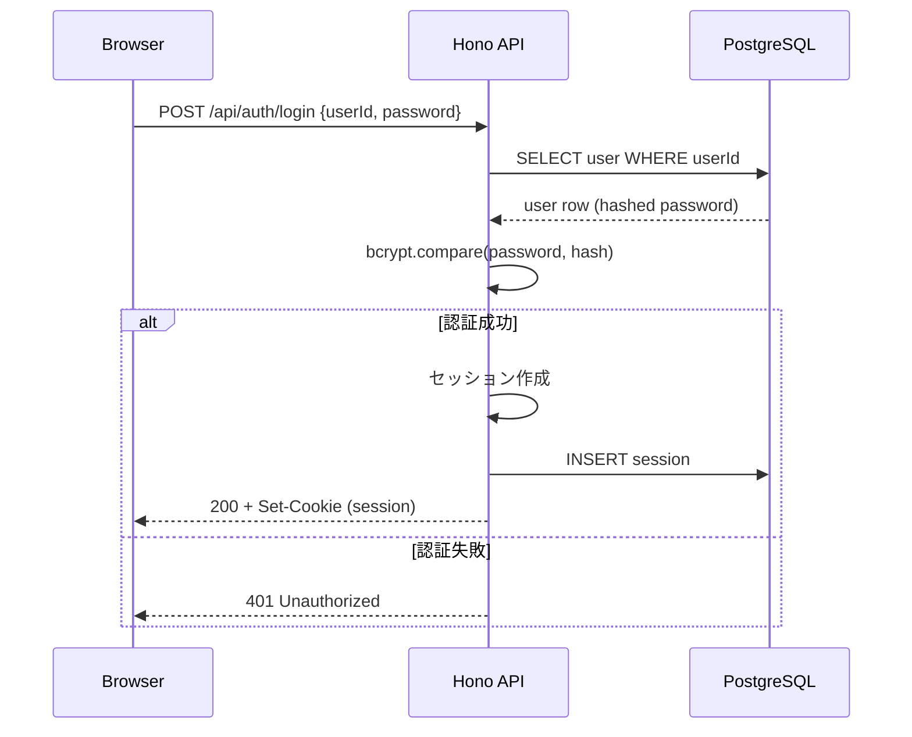
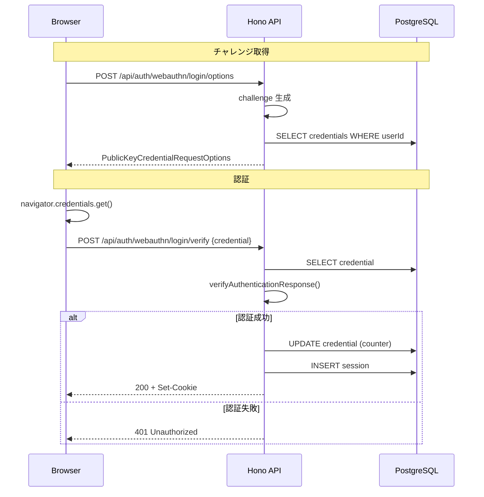
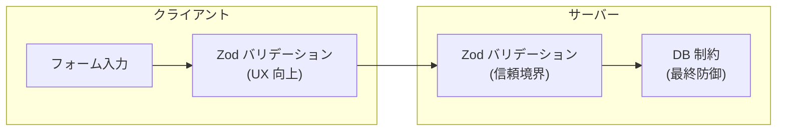

## 全体像

## リクエスト〜レスポンス

### 1. ページ表示（データ取得）

TanStack Router の `loader` を通じてサーバーサイドでデータを取得し、SSR で描画する。

**フロー:**

1. ブラウザが URL にアクセス（例: `/dashboard`）
2. TanStack Router が該当ルートの `loader` を実行
3. `loader` 内の Server Function がサーバーサイドで Hono API を呼び出し
4. Hono handler が認証チェック → `@repo/db`（Drizzle ORM）でクエリ実行
5. 結果が loader → Router → React コンポーネントに渡され描画

### 2. 記録の作成

クライアントから Hono API を直接呼び出し、記録を作成する。

**フロー:**

1. ユーザーがフォームで体力・気力・コメントを入力
2. クライアントが `POST /api/records` に JSON を送信
3. Hono middleware で認証チェック（セッション Cookie）
4. Zod スキーマでリクエストボディをバリデーション
5. `@repo/db`（Drizzle ORM）で `records` テーブルに INSERT
6. 成功レスポンス（201）を返却
7. クライアント側で TanStack Router の `invalidate` を呼び、一覧を再取得

### 3. 記録の更新

**フロー:**

1. ユーザーが一覧から記録を選択し、編集画面を開く
2. `loader` で既存データを取得してフォームにプリフィル
3. 変更後 `PATCH /api/records/:id` に JSON を送信
4. Hono middleware で認証チェック + 所有者チェック
5. Zod スキーマでバリデーション
6. `@repo/db`（Drizzle ORM）で UPDATE
7. 成功レスポンス（200）を返却

## 認証フロー

### パスワード認証

### パスキー認証（WebAuthn）

## API エンドポイントとデータフローの対応

| エンドポイント | メソッド | データの流れ | 認証 |
| --- | --- | --- | --- |
| `/api/auth/register` | POST | ユーザー登録 → users INSERT | 不要 |
| `/api/auth/login` | POST | パスワード検証 → セッション作成 | 不要 |
| `/api/auth/logout` | POST | セッション削除 | 必要 |
| `/api/auth/webauthn/*` | POST | パスキー登録・認証 | 一部必要 |
| `/api/records` | GET | 記録一覧取得 (WHERE user_id = 自分) | 必要 |
| `/api/records` | POST | 記録作成 → records INSERT | 必要 |
| `/api/records/:id` | GET | 記録詳細取得 + 所有者チェック | 必要 |
| `/api/records/:id` | PATCH | 記録更新 + 所有者チェック | 必要 |
| `/api/records/:id` | DELETE | 記録削除 + 所有者チェック | 必要 |

## 状態管理

### サーバー状態

| データ | 管理方法 | キャッシュ |
| --- | --- | --- |
| 記録データ | TanStack Router loader | Router cache (自動 invalidation) |
| ユーザー情報 | セッション Cookie | サーバーサイドセッション |

### クライアント状態

| データ | 管理方法 |
| --- | --- |
| フォーム入力値 | React state (useState / useForm) |
| グラフ表示期間 | URL search params (型安全) |
| テーマ (Light/Dark) | localStorage + React context |

## バリデーション戦略

バリデーションはクライアント・サーバーの両方で実施し、Zod スキーマを共有する。

| レイヤー | 役割 | 例 |
| --- | --- | --- |
| クライアント | 即時フィードバック | 体力が 0〜5 の範囲か、コメントが 200 文字以内か |
| サーバー (Zod) | 信頼できるバリデーション | 全入力の再検証、型変換 |
| DB 制約 | データ整合性の最終保証 | NOT NULL, CHECK, UNIQUE |

## 非同期・バッチ

MVP v1・v2 の時点では非同期処理やバッチジョブは不要。すべてのデータ操作はリクエスト/レスポンスのサイクル内で同期的に完結する。

### MVP v3 以降で検討

| 処理 | 想定方式 | 用途 |
| --- | --- | --- |
| AI フィードバック生成 | 非同期ジョブ or ストリーミング | 記録保存後に AI コメントを生成 |
