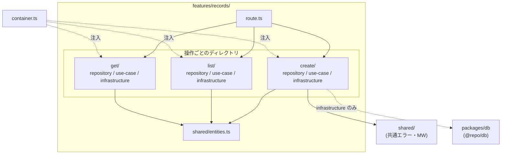
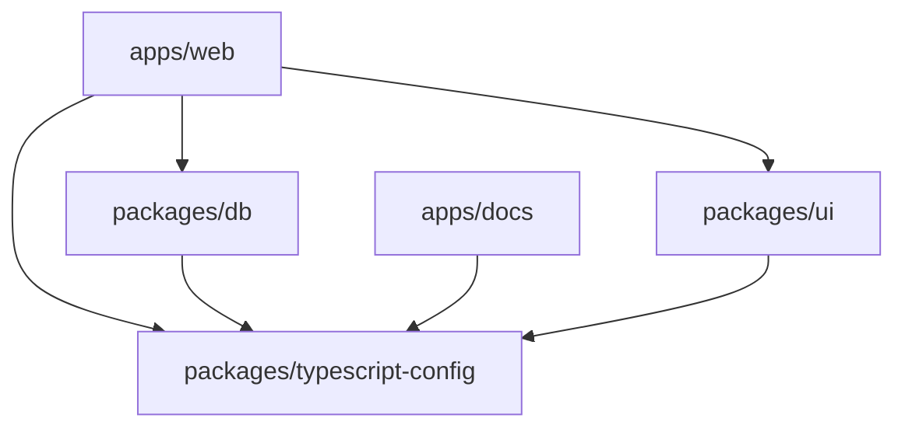

## レイアウト

```
hp-memos/
├── apps/
│   ├── web/          … メインアプリケーション（TanStack Start）
│   └── docs/         … ドキュメントサイト（Fumadocs / Next.js）
├── packages/
│   ├── db/           … DB スキーマ・接続・マイグレーション
│   ├── ui/           … 共有 UI コンポーネント
│   └── typescript-config/  … 共有 tsconfig
├── turbo.json        … Turborepo タスク定義
├── pnpm-workspace.yaml
├── package.json      … ルートの devDependencies・スクリプト
└── biome.json        … Biome (Lint + Format) 設定
```

## パッケージ一覧

### apps/

| パッケージ | 説明 | デプロイ先 | 主要技術 |
| --- | --- | --- | --- |
| `apps/web` | メインの Web アプリケーション。記録入力・一覧・グラフ・認証を提供 | Vercel | TanStack Start, Hono, React 19 |
| `apps/docs` | プロジェクトのドキュメントサイト。設計書・ADR・規約を管理 | Vercel | Fumadocs, Next.js |

### packages/

| パッケージ | 説明 | 依存元 |
| --- | --- | --- |
| `packages/db` | DB スキーマ定義・接続・マイグレーション（Drizzle ORM） | `apps/web` |
| `packages/ui` | 共有 UI コンポーネント（ボタン・カードなど） | `apps/web` |
| `packages/typescript-config` | 共有の `tsconfig.json` プリセット | 全パッケージ |

## packages/db の内部構成

```
packages/db/
├── src/
│   ├── index.ts          … DB 接続 & 全エクスポート
│   ├── client.ts         … Drizzle クライアント生成
│   ├── seed.ts           … 開発用シードデータ生成
│   ├── seed-cli.ts       … db:seed の実行エントリ
│   └── schema/
│       ├── index.ts      … 全スキーマの re-export
│       ├── users.ts      … users テーブル
│       ├── sessions.ts   … sessions テーブル
│       ├── records.ts    … records テーブル
│       └── credentials.ts … WebAuthn credentials テーブル
├── tests/                … PGlite 上でマイグレーションを適用して検証
│   ├── helpers/
│   │   └── test-db.ts    … インメモリ DB の起動とマイグレーション適用
│   └── *.test.ts         … テーブルごとのテスト
├── drizzle/              … マイグレーションファイル（自動生成）
├── drizzle.config.ts     … Drizzle Kit 設定
├── vitest.config.ts      … テスト設定
├── package.json
└── tsconfig.json
```

スキーマはテーブルごとにファイルを分割し、`schema/index.ts` で re-export する。

```ts
// schema/users.ts
import { pgTable, text, timestamp } from "drizzle-orm/pg-core";

export const users = pgTable("users", {
  id: text("id").primaryKey(),
  // ...
});
```

```ts
// schema/index.ts
export * from "./users";
export * from "./sessions";
export * from "./records";
export * from "./credentials";
```

`apps/web` からは `@repo/db` として利用する。

```ts
import { getDb } from "@repo/db";
import { users, records } from "@repo/db/schema";
```

## apps/web の内部構成

```
apps/web/src/
├── routes/           … ページコンポーネント（ファイルベースルーティング）
│   ├── __root.tsx    … ルートレイアウト
│   ├── index.tsx     … トップページ
│   └── about.tsx
├── components/       … UI コンポーネント
│   ├── Header.tsx
│   ├── Footer.tsx
│   └── ThemeToggle.tsx
├── lib/              … ユーティリティ
│   └── utils.ts
├── router.tsx        … ルーター設定
├── routeTree.gen.ts  … 自動生成されたルートツリー
└── styles.css        … グローバルスタイル
```

### 今後追加予定のディレクトリ

API は[クリーンアーキテクチャ](/docs/architecture/api-architecture)に基づいた構成とする。

```
apps/web/src/
├── routes/
│   ├── _authed/              … 認証必須レイアウトグループ
│   │   ├── index.tsx         … 今日
│   │   ├── history.tsx       … 履歴
│   │   ├── records.$date.tsx … その日の記録
│   │   └── settings.tsx      … 設定
│   ├── login.tsx             … ログイン
│   └── register.tsx          … アカウント登録
├── components/
│   ├── ui/                   … 汎用 UI（Button, Slider, Card ...）
│   └── features/             … ドメイン固有（RecordForm, GraphChart ...）
├── lib/
│   ├── api.ts                … Hono API クライアント（hc 型推論）
│   ├── auth.ts               … 認証ユーティリティ
│   └── validators.ts         … Zod スキーマ（クライアント・サーバー共有）
├── server/                              … クリーンアーキテクチャ（操作単位の垂直スライス）
│   ├── features/                        … エンドポイントごとの機能モジュール
│   │   ├── auth/
│   │   │   ├── shared/
│   │   │   │   └── entities.ts          … User, Session, Credential 型
│   │   │   ├── register/               … 操作ごとにディレクトリ分離
│   │   │   │   ├── repository.ts        … この操作専用の Repository Interface
│   │   │   │   ├── use-case.ts
│   │   │   │   └── infrastructure.ts
│   │   │   ├── login/
│   │   │   │   ├── repository.ts
│   │   │   │   ├── use-case.ts
│   │   │   │   └── infrastructure.ts
│   │   │   ├── logout/
│   │   │   │   ├── repository.ts
│   │   │   │   ├── use-case.ts
│   │   │   │   └── infrastructure.ts
│   │   │   ├── me/
│   │   │   │   ├── repository.ts
│   │   │   │   ├── use-case.ts
│   │   │   │   └── infrastructure.ts
│   │   │   └── route.ts                … Hono ルートハンドラ
│   │   ├── records/
│   │   │   ├── shared/
│   │   │   │   └── entities.ts          … Record 型
│   │   │   ├── create/
│   │   │   │   ├── repository.ts
│   │   │   │   ├── use-case.ts
│   │   │   │   └── infrastructure.ts
│   │   │   ├── list/
│   │   │   │   ├── repository.ts
│   │   │   │   ├── use-case.ts
│   │   │   │   └── infrastructure.ts
│   │   │   ├── get/
│   │   │   │   ├── repository.ts
│   │   │   │   ├── use-case.ts
│   │   │   │   └── infrastructure.ts
│   │   │   ├── update/
│   │   │   │   ├── repository.ts
│   │   │   │   ├── use-case.ts
│   │   │   │   └── infrastructure.ts
│   │   │   ├── delete/
│   │   │   │   ├── repository.ts
│   │   │   │   ├── use-case.ts
│   │   │   │   └── infrastructure.ts
│   │   │   └── route.ts
│   │   └── health/
│   │       └── route.ts
│   ├── shared/                          … 複数 feature で共有する横断的関心事
│   │   ├── errors.ts                    … 共通ドメインエラー
│   │   └── middleware/
│   │       ├── auth.ts                  … 認証ミドルウェア
│   │       └── error-handler.ts         … DomainError → HTTP レスポンス変換
│   ├── app.ts                           … Hono アプリ定義・全 feature ルートマウント
│   └── container.ts                     … DI コンテナ（操作ごとの Repository をワイヤリング）
└── types/                               … 共有型定義
    └── index.ts
```

`server/` 配下の依存関係（操作単位）:



## 依存関係グラフ



## Turborepo タスク

| タスク | コマンド | 説明 |
| --- | --- | --- |
| `build` | `turbo run build` | 全パッケージのビルド（依存順） |
| `dev` | `turbo run dev` | 全アプリの開発サーバー起動 |
| `dev:web` | `turbo run dev --filter=web` | Web アプリのみ開発サーバー起動 |
| `dev:docs` | `turbo run dev --filter=docs` | ドキュメントサイトのみ起動 |
| `lint` | `turbo run lint` | 全パッケージの Lint 実行 |
| `check-types` | `turbo run check-types` | 全パッケージの型チェック |

## パッケージ追加の方針

- **共有ロジック**: `packages/` に新パッケージとして切り出す
- **アプリ固有ロジック**: 各 `apps/` 内に閉じる
- **packages に切り出す基準**: 2つ以上の apps から参照される、またはテスト・再利用の単位として独立させたい場合
