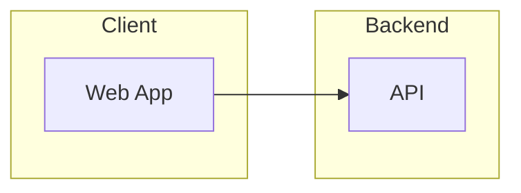

## 概要

主要コンポーネントとその関係を示す。

```mermaid
flowchart LR
  subgraph client[Client]
    Web[Web App]
  end
  subgraph server[Backend]
    API[API]
  end
  Web --> API
```

（図は実態に合わせて更新する。）

## 境界

- （公開境界・信頼境界・外部連携）
