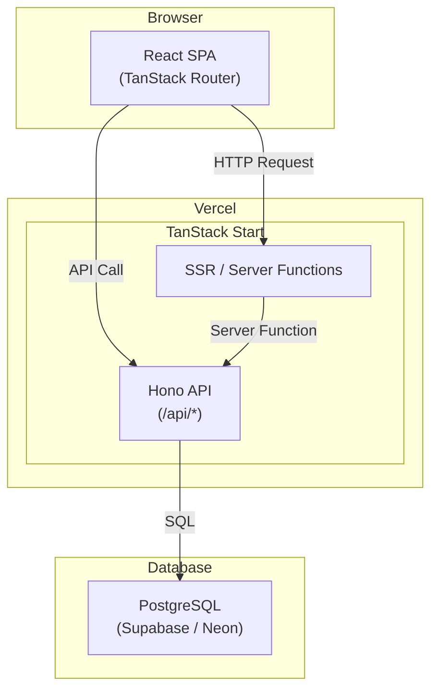
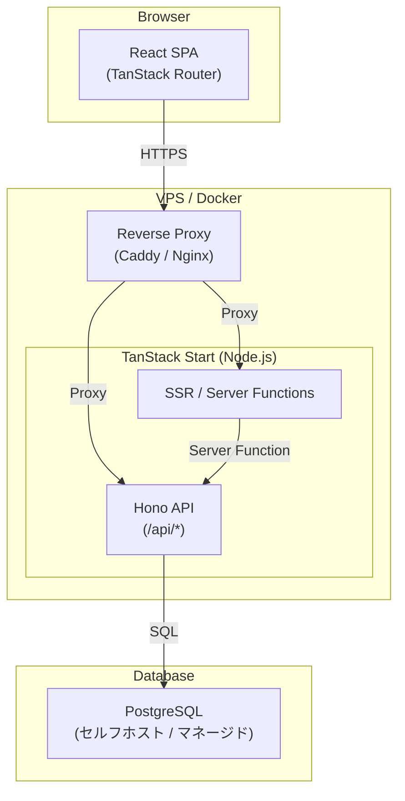
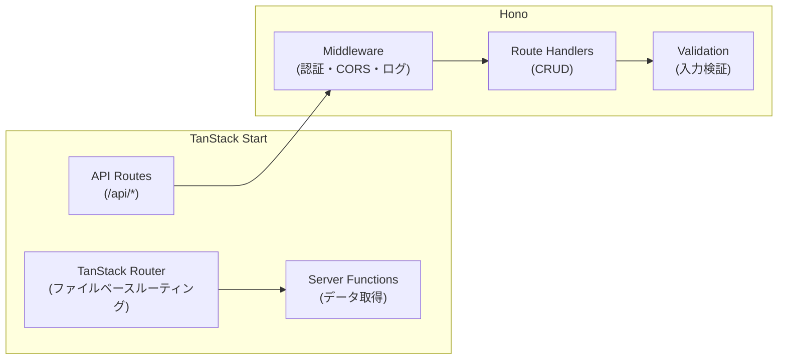
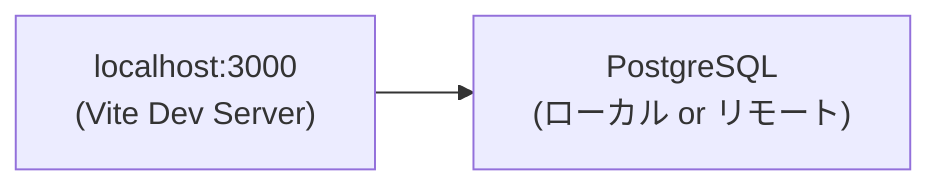
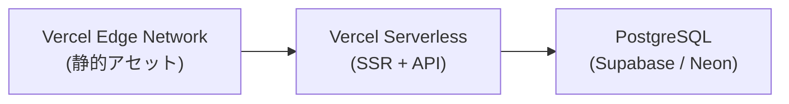
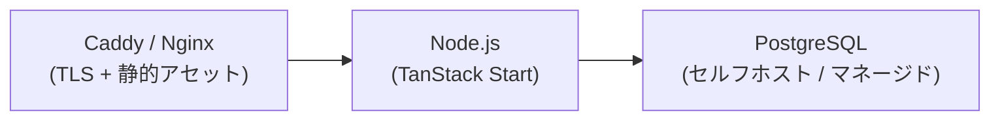

## 概要

hp-memos は TanStack Start（フルスタック React フレームワーク）を中心に、Hono API・PostgreSQL で構成されるシンプルなフルスタックアプリケーションである。

デプロイ先は **パターン A: Vercel**（マネージド）と **パターン B: 自前サーバー**（VPS / Docker）の 2 パターンを想定している。

### パターン A: Vercel

### パターン B: 自前サーバー

## レイヤー構成

| レイヤー | 責務 | 技術 |
| --- | --- | --- |
| プレゼンテーション | UI 描画・ユーザー操作の受け付け | React 19 + TanStack Router |
| サーバー | SSR・Server Functions・静的アセット配信 | TanStack Start (Vite) |
| API | ビジネスロジック・認証・バリデーション | Hono |
| データアクセス | DB クエリ・マイグレーション | ORM + PostgreSQL |
| インフラ | ホスティング・CI/CD・DNS | Vercel or VPS + Supabase/Neon/セルフホスト |

## コンポーネント間の関係

### TanStack Start + Hono の統合

TanStack Start はフルスタックフレームワークとして SSR とサーバーサイド処理を担う。Hono は TanStack Start の API ルート（`/api/*`）にマウントされ、REST API を提供する。

- **Router Loader**: ページ表示時のデータ取得は TanStack Router の loader で Server Functions を経由して取得
- **API Routes**: 記録の作成・更新・削除は Hono API エンドポイントを呼び出し
- **Middleware**: 認証チェック・入力バリデーション・エラーハンドリングは Hono middleware で共通化

## 境界

### 信頼境界

| 境界 | 説明 |
| --- | --- |
| ブラウザ ↔ サーバー | すべての入力はサーバーサイドで再検証する |
| サーバー ↔ DB | ORM 経由のパラメータ化クエリで SQL インジェクションを防止 |

### 認証境界

| リソース | アクセスポリシー |
| --- | --- |
| `/api/auth/*` | 未認証ユーザーがアクセス可能 |
| `/api/records/*` | 認証済みユーザーのみ、自分のデータのみ |
| `/login`, `/register` | 未認証ユーザー向け |
| `/dashboard`, `/records/*` | 認証済みユーザーのみ |

### 外部連携

| 外部サービス | 用途 | 通信方式 | パターン |
| --- | --- | --- | --- |
| Vercel | ホスティング・CDN・CI/CD | Git push による自動デプロイ | A |
| Supabase / Neon | マネージド PostgreSQL | TCP/TLS (接続プール) | A / B |
| VPS (Hetzner, etc.) | サーバーホスティング | SSH / Docker | B |
| Caddy / Nginx | リバースプロキシ・TLS 終端 | HTTP/HTTPS | B |

## デプロイ構成

### 共通: 開発環境

### パターン A: Vercel

### パターン B: 自前サーバー

### 環境一覧

| 環境 | パターン | URL | DB |
| --- | --- | --- | --- |
| 開発 | 共通 | `http://localhost:3000` | ローカル or リモート開発用 DB |
| 本番 | A (Vercel) | Vercel 提供 URL | Supabase / Neon (Free Tier) |
| 本番 | B (自前) | 独自ドメイン | セルフホスト or マネージド PostgreSQL |
