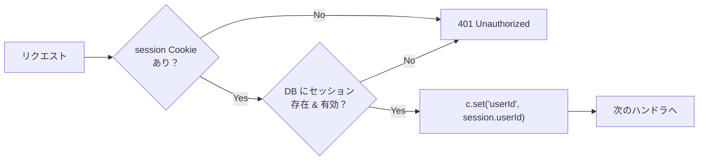

## ベース URL

| 環境 | ベース URL |
| --- | --- |
| 開発 | `http://localhost:3000/api` |
| 本番 (Vercel) | `https://<app>.vercel.app/api` |
| 本番 (自前) | `https://<domain>/api` |

すべてのエンドポイントは `/api` プレフィクス配下に配置される。Hono が TanStack Start の `/api/*` ルートにマウントされる構成。

## エンドポイント一覧

| メソッド | パス | 説明 | 認証 | 詳細 |
| --- | --- | --- | --- | --- |
| `GET` | `/api/health` | ヘルスチェック | 不要 | [health](/docs/design/api/health) |
| `POST` | `/api/auth/register` | アカウント登録 | 不要 | [auth](/docs/design/api/auth) |
| `POST` | `/api/auth/login` | ログイン（パスワード） | 不要 | [auth](/docs/design/api/auth) |
| `POST` | `/api/auth/logout` | ログアウト | 必要 | [auth](/docs/design/api/auth) |
| `GET` | `/api/auth/me` | 現在のユーザー情報取得 | 必要 | [auth](/docs/design/api/auth) |
| `POST` | `/api/auth/webauthn/register/options` | パスキー登録オプション取得 | 必要 | [auth-webauthn](/docs/design/api/auth-webauthn) |
| `POST` | `/api/auth/webauthn/register/verify` | パスキー登録検証 | 必要 | [auth-webauthn](/docs/design/api/auth-webauthn) |
| `POST` | `/api/auth/webauthn/login/options` | パスキー認証オプション取得 | 不要 | [auth-webauthn](/docs/design/api/auth-webauthn) |
| `POST` | `/api/auth/webauthn/login/verify` | パスキー認証検証 | 不要 | [auth-webauthn](/docs/design/api/auth-webauthn) |
| `GET` | `/api/records` | 記録一覧取得 | 必要 | [records](/docs/design/api/records) |
| `POST` | `/api/records` | 記録作成 | 必要 | [records](/docs/design/api/records) |
| `GET` | `/api/records/:id` | 記録詳細取得 | 必要 | [records](/docs/design/api/records) |
| `PATCH` | `/api/records/:id` | 記録更新 | 必要 | [records](/docs/design/api/records) |
| `DELETE` | `/api/records/:id` | 記録削除 | 必要 | [records](/docs/design/api/records) |

## 共通仕様

### リクエスト

| 項目 | 仕様 |
| --- | --- |
| Content-Type | `application/json` |
| 認証 | Cookie ベースのセッション（`session` Cookie） |
| 文字エンコーディング | UTF-8 |

### レスポンス

| 項目 | 仕様 |
| --- | --- |
| Content-Type | `application/json` |
| 日時形式 | ISO 8601（`2025-04-03T12:00:00.000Z`） |
| 日付形式 | `YYYY-MM-DD`（`2025-04-03`） |
| ID 形式 | CUID2（`clxxxxxxxxxxxxxxxxxxxxxxxxx`） |

### エラーレスポンス

すべてのエラーは統一フォーマットで返却する。

```json
{
  "error": {
    "code": "VALIDATION_ERROR",
    "message": "リクエストの入力値が不正です",
    "details": [
      {
        "field": "physical",
        "message": "0〜5 の範囲・0.5 刻みで入力してください"
      }
    ]
  }
}
```

| フィールド | 型 | 必須 | 説明 |
| --- | --- | --- | --- |
| `error.code` | `string` | Yes | エラーコード（下表参照） |
| `error.message` | `string` | Yes | ユーザー向けメッセージ |
| `error.details` | `object[]` | No | フィールド単位のエラー詳細（バリデーションエラー時） |

### エラーコード一覧

| コード | HTTP ステータス | 説明 |
| --- | --- | --- |
| `VALIDATION_ERROR` | 400 | 入力値バリデーション失敗 |
| `UNAUTHORIZED` | 401 | 未認証（セッションなし or 期限切れ） |
| `FORBIDDEN` | 403 | アクセス権限なし（他ユーザーのリソース） |
| `NOT_FOUND` | 404 | リソースが存在しない |
| `CONFLICT` | 409 | 重複（同日の記録が既に存在する等） |
| `RATE_LIMITED` | 429 | レート制限超過 |
| `INTERNAL_ERROR` | 500 | サーバー内部エラー |

### ページネーション

記録一覧 API はオフセットベースのページネーションを提供する。

**リクエストパラメータ:**

| パラメータ | 型 | デフォルト | 説明 |
| --- | --- | --- | --- |
| `limit` | `number` | `20` | 取得件数（最大 100） |
| `offset` | `number` | `0` | スキップ件数 |

**レスポンスメタ:**

```json
{
  "data": [],
  "meta": {
    "total": 150,
    "limit": 20,
    "offset": 0
  }
}
```

## Hono ルート構成

```ts
import { Hono } from "hono";
import { authRoutes } from "./auth";
import { recordRoutes } from "./records";
import { authMiddleware } from "../middleware/auth";

const api = new Hono()
  .get("/health", (c) => {
    return c.json({ status: "ok", timestamp: new Date().toISOString() });
  })
  .route("/auth", authRoutes)
  .use("/records/*", authMiddleware)
  .route("/records", recordRoutes);

export type ApiType = typeof api;
export default api;
```

Hono の型推論により、`ApiType` をクライアント側で利用して型安全な API 呼び出しが可能。

## ミドルウェア

### 認証ミドルウェア



| 処理 | 説明 |
| --- | --- |
| Cookie 取得 | `session` Cookie からトークンを取得 |
| セッション検索 | `sessions` テーブルで ID 検索 |
| 有効期限チェック | `expires_at > now()` を確認 |
| ユーザー ID 設定 | Hono の `c.set()` で後続ハンドラに渡す |

### 所有者チェック

`records` リソースへのアクセス時、記録の `user_id` と認証済みユーザーの `userId` が一致することを確認する。

```ts
const record = await db.query.records.findFirst({
  where: eq(records.id, id),
});

if (!record) {
  return c.json(
    { error: { code: "NOT_FOUND", message: "記録が見つかりません" } },
    404,
  );
}
if (record.userId !== c.get("userId")) {
  return c.json(
    { error: { code: "FORBIDDEN", message: "アクセス権限がありません" } },
    403,
  );
}
```

## セッション管理

| 項目 | 仕様 |
| --- | --- |
| トークン生成 | `crypto.randomBytes(32).toString('hex')` |
| 有効期限 | 30 日間 |
| 保存先 | `sessions` テーブル |
| Cookie 属性 | `HttpOnly; Secure; SameSite=Lax; Path=/` |
| 期限切れ削除 | API リクエスト時に判定。定期バッチは MVP スコープ外 |

## レート制限

| エンドポイント | 制限 | ウィンドウ | ブロック期間 |
| --- | --- | --- | --- |
| `POST /api/auth/login` | 5 回失敗 | — | 15 分間ロック |
| `POST /api/auth/register` | 3 回 | 1 時間 | — |
| `POST /api/auth/webauthn/login/*` | 5 回 | 1 分 | — |
| その他 | 100 回 | 1 分 | — |

MVP ではインメモリでカウントする。スケールする場合は Redis 等に移行。

## CORS

| 項目 | 設定 |
| --- | --- |
| Origin | 同一オリジン（TanStack Start にマウントのため CORS 不要が基本） |
| 開発時 | Vite のプロキシ設定で同一オリジン化 |
| 外部からの API 利用 | MVP スコープ外（必要になれば Hono の `cors()` middleware で対応） |
