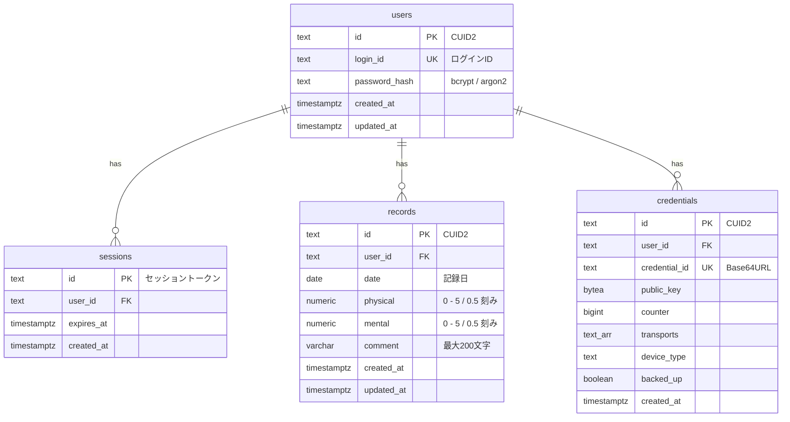

## ER 図



## テーブル一覧

| テーブル | 説明 | 詳細 |
| --- | --- | --- |
| [`users`](/docs/design/db/users) | ユーザーアカウント | ログイン ID・パスワードハッシュ |
| [`sessions`](/docs/design/db/sessions) | サーバーサイドセッション | セッショントークン・有効期限 |
| [`records`](/docs/design/db/records) | コンディション記録 | 体力・気力・コメント |
| [`credentials`](/docs/design/db/credentials) | WebAuthn パスキー | 公開鍵・カウンタ |

## 共通規約

| 項目 | 方針 |
| --- | --- |
| 主キー生成 | CUID2（`@paralleldrive/cuid2`）。sessions のみ `crypto.randomBytes` |
| タイムスタンプ | `timestamptz`（UTC）。全テーブルに `created_at`、変更可能テーブルに `updated_at` |
| 外部キー | ON DELETE CASCADE（ユーザー削除時に関連データを連鎖削除） |
| 文字列型 | 固定長制限がある場合は `varchar(n)`、それ以外は `text` |
| ORM | Drizzle ORM（`packages/db/src/schema/` にテーブルごとのファイル） |

## データ量の見積もり

| テーブル | 年間増加量 | 5 年後の想定 | 備考 |
| --- | --- | --- | --- |
| `users` | 1 件 | 1 件 | 個人利用 |
| `sessions` | ～50 件 | ～50 件 | 期限切れは定期削除 |
| `records` | ～730 件（v2: 朝夜各 1） | ～3,650 件 | 極めて少量 |
| `credentials` | ～3 件 | ～5 件 | デバイスごとに 1 件 |

Free Tier の 500 MB 制限に対して十分余裕がある。インデックスを含めても 1 MB 未満の見込み。

## マイグレーション方針

| 項目 | 方針 |
| --- | --- |
| ツール | Drizzle Kit (`drizzle-kit generate` / `drizzle-kit migrate`) |
| ファイル配置 | `packages/db/drizzle/` 配下に自動生成 |
| 命名規則 | Drizzle Kit のデフォルト（タイムスタンプベース） |
| 適用順序 | CI/CD パイプラインでデプロイ前に自動実行 |
| ロールバック | Drizzle Kit はロールバック非対応のため、手動で逆マイグレーション SQL を用意 |
| 本番適用 | `drizzle-kit migrate` をデプロイスクリプト内で実行 |

## シード・初期データ

開発環境用のシードデータを `packages/db/src/seed.ts` に配置する。

```ts
import { db } from "./client";
import { users, records } from "./schema";
import { hash } from "bcrypt";
import { createId } from "@paralleldrive/cuid2";

async function seed() {
  const userId = createId();

  await db.insert(users).values({
    id: userId,
    loginId: "testuser",
    passwordHash: await hash("Test1234!", 12),
  });

  const today = new Date();
  for (let i = 0; i < 30; i++) {
    const date = new Date(today);
    date.setDate(date.getDate() - i);
    await db.insert(records).values({
      userId,
      date: date.toISOString().split("T")[0],
      physical: Math.round(Math.random() * 10) / 2,
      mental: Math.round(Math.random() * 10) / 2,
      comment: i === 0 ? "今日は調子が良い" : null,
    });
  }
}
```
