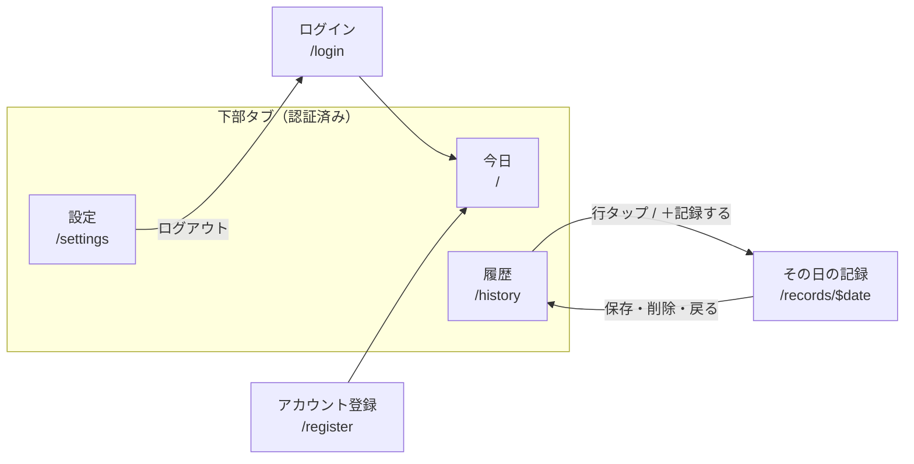

MVP v1 で実装する画面の一覧と、全画面に共通するルールを定義する。個別の画面仕様は各ページを参照。

対応するユーザーストーリーは [機能要件](/docs/requirements/functional)、データ構造は [records テーブル](/docs/design/db/records)、通信仕様は [記録 API](/docs/design/api/records) を一次情報源とする。

## 画面一覧

| 画面 | ルート | 認証 | 概要 | 詳細 |
| --- | --- | --- | --- | --- |
| ログイン | `/login` | 不要 | ユーザーID / パスワード・パスキー認証 | [認証・設定](/docs/design/screens/auth-settings) |
| アカウント登録 | `/register` | 不要 | 新規ユーザー登録 | [認証・設定](/docs/design/screens/auth-settings) |
| 今日 | `/` | 必要 | 当日の記録入力・直近 7 日グラフ | [今日](/docs/design/screens/today) |
| 履歴 | `/history` | 必要 | 推移グラフ・記録一覧 | [履歴](/docs/design/screens/history) |
| その日の記録 | `/records/$date` | 必要 | 過去日の閲覧・編集・新規入力・削除 | [その日の記録](/docs/design/screens/record-detail) |
| 設定 | `/settings` | 必要 | パスキー管理・ログアウト | [認証・設定](/docs/design/screens/auth-settings) |

## ナビゲーション構成

認証後の 3 画面（今日 / 履歴 / 設定）を下部タブで並列に置き、`/records/$date` のみ履歴から掘り下げる階層に置く。

### 下部タブ

| タブ | ルート | 役割 |
| --- | --- | --- |
| 今日 | `/` | 毎日の記録。アプリの主動線 |
| 履歴 | `/history` | 振り返り |
| 設定 | `/settings` | 認証情報の管理 |

`/records/$date` はタブを持たない下層画面とし、戻る操作で呼び出し元に戻る。

### 未認証時の扱い

認証が必要な画面に未認証でアクセスした場合、`/login` にリダイレクトする。ログイン成功後は `/`（今日）に遷移する。

## 全画面共通のルール

### コンディションの表示・入力

体力・気力は **0〜5 の 0.5 刻み（11 段階）**。詳細は [records テーブルの「スケール」節](/docs/design/db/records)。

| 項目 | ルール |
| --- | --- |
| 入力部品 | 11 段の目盛りバー（`ConditionBar`）。タップ・ドラッグの両方で値が入る |
| 数値表記 | 常に小数第 1 位まで（`3.5` / `4.0`）。`4` とは書かない |
| 色 | 体力＝プライマリ、気力＝アクセント。全画面で固定し、系列の識別に使う |
| 記録がない場合の表示 | 一覧・詳細ともに `—`。入力バーの初期値は各画面で定める |

段の高さを左から右へ段階的に上げることで、数値を読まずに「何段目か」を形で把握できるようにする。

### 差分（回復量・消耗量）の表示

差分は必ず **起点を明示して** 表示する。符号付きの数値のみを置くと、何を基準にした増減か判別できないため。

| 画面 | 起点 | 表記 |
| --- | --- | --- |
| 朝の記録 | 前日夜の記録 | `前夜から +1.5`（US-11 回復量） |
| 夜の記録 | 同日朝の記録 | `朝から −2.0`（US-12 消耗量） |

- 入力バー上には起点の値を **点線マーカー** で重ね、差を距離としても示す。マーカーには起点の実値（`朝 3.5`）を添える。
- **起点となる記録が存在しない場合、差分は表示しない**。点線マーカー・起点ラベル・数値をまとめて省略する。
- 一覧など列見出しを持たない文脈では、`体力 3.5 → 1.5` の矢印形式を使う。

### レスポンシブ

[非機能要件](/docs/requirements/non-functional)に従い、モバイルファーストで設計する。

| 項目 | 仕様 |
| --- | --- |
| 基準幅 | 320px（最小対応幅）で全画面が破綻しないこと |
| ブレークポイント | モバイル（〜768px）/ デスクトップ（769px〜） |
| デスクトップ | コンテンツ幅に上限を設けて中央寄せする。下部タブは横並びのヘッダーナビに切り替える |

### 空状態

| 状況 | 表示 |
| --- | --- |
| 記録が 1 件もない（初回） | 今日: 通常どおり入力欄を表示する。履歴: グラフ・一覧の代わりに「まだ記録がありません」と今日タブへの導線 |
| 期間内に記録がない | グラフ領域に「この期間の記録がありません」 |

### エラー表示

API のエラーレスポンスは `{ error: { code, message, details? } }` の統一フォーマットで返る（[API 設計](/docs/design/api)）。画面側は `code` で分岐する。

| `code` | 画面の挙動 |
| --- | --- |
| `VALIDATION_ERROR` | 該当フィールドの直下にメッセージを表示。保存は行わない |
| `CONFLICT` | 既存記録があるため、その記録の編集に切り替える（[その日の記録](/docs/design/screens/record-detail)を参照） |
| `NOT_FOUND` | 「記録が見つかりません」を表示し、履歴に戻る導線を出す |
| `AUTHENTICATION_ERROR` | `/login` にリダイレクトする |
| 通信失敗 | トーストで再試行を促す。入力値は保持する |

## 設計判断の記録

この構成に至った判断のうち、コードからは読み取れないものを残す。

| 判断 | 理由 |
| --- | --- |
| ホームを「今日の記録」にした | 毎日の主行動が「今日の体力・気力を記録する」1 つであり、一覧をホームに置くと記録までが 2 ステップになるため |
| グラフ専用画面を作らなかった | 当初案ではダッシュボードとグラフ画面の役割が重複していた。グラフを今日（直近 7 日）と履歴（期間切替）に分けることで重複が解消される |
| 朝／夜を上下に並べずタブにした | 320px では朝夜を縦積みすると入力欄がファーストビューから外れる。記録は疲れている夜に行うため、入力までの距離を最短に保つことを優先した |
| 編集専用画面を分けず `/records/$date` に集約した | 「過去日の新規入力」「編集」「削除」はいずれも特定の日付を対象とする操作であり、同じ UI で扱える。今日（`/`）もこの画面を今日の日付で開いたものとして実装する |
| 差分に起点ラベルを付けた | 数値のみでは何を基準にした増減か伝わらない。点線マーカーだけでも起点の説明にならないため、語で明示する |
| グラフの欠損日で線を切る | 未記録日を線で結ぶと「記録がない」と「値が低い」が区別できなくなる。空白が見えること自体が過去日入力を促す合図にもなる |

## 既存ドキュメントとの差分

画面設計の確定にあたり MVP のスコープを見直した結果、以下のドキュメントに未反映の変更がある。**実装前にこれらを更新する必要がある。**

| ドキュメント | 必要な変更 |
| --- | --- |
| [機能要件](/docs/requirements/functional) | US-4 の「日付は自動で当日日付を付与（手動変更は不可）」を撤回する（過去日の入力を許可したため）。US-10〜US-13 を MVP v2 から v1 へ移動。記録削除のユーザーストーリーを追加。画面一覧を本ページの表に差し替え |
| [機能要件](/docs/requirements/functional) | US-11 / US-12 の「データ不足時は `—` と表示」を「差分表示ごと省略する」に改める |
| [記録 API](/docs/design/api/records) | `POST /api/records` のリクエストボディに `date`（省略時は当日）と `timeOfDay` を v1 仕様として追加。重複チェックを同日・同タイミング単位に変更。「MVP v2 での変更」節を解消 |
| [records テーブル](/docs/design/db/records) | `time_of_day` を v1 のカラムに昇格。ユニーク制約を `(user_id, date, time_of_day)` に変更。「MVP v2 マイグレーション」節を解消 |
| [プロダクトコンセプト](/docs/overview/concept) | MVP v1 / v2 の区分を更新（朝夜の区別・回復量・消耗量が v1 に入ったため） |
